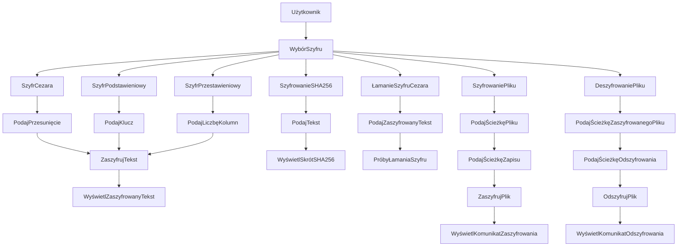
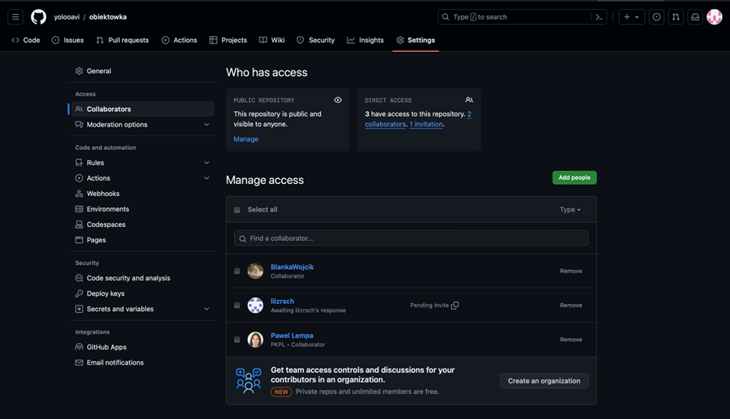
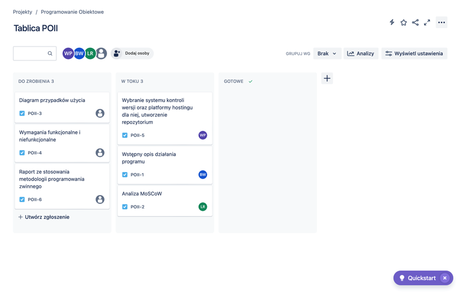
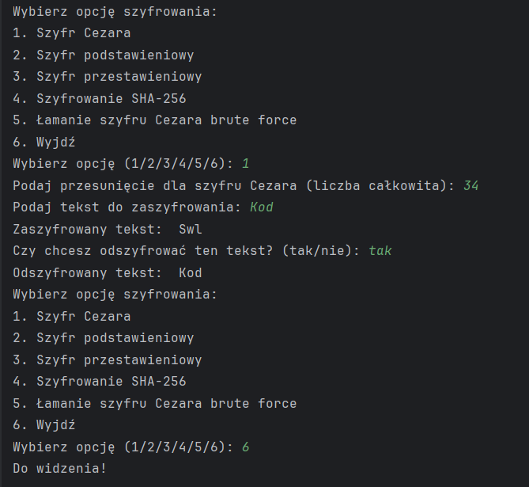
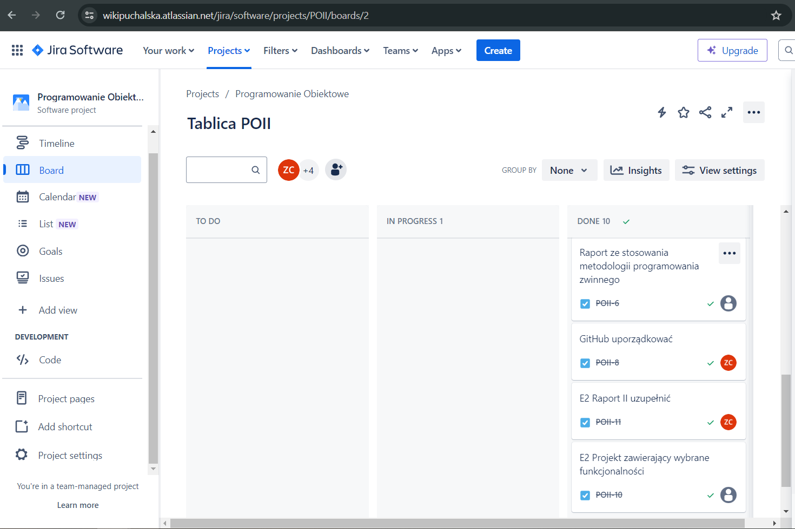
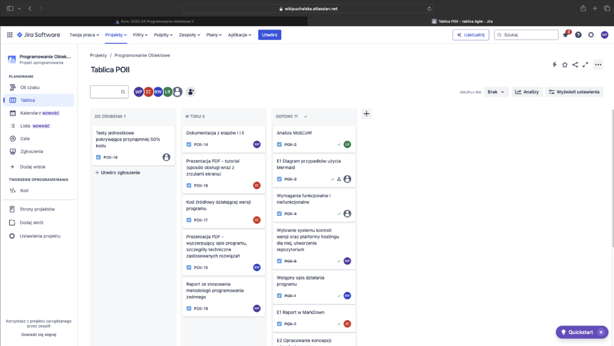

# Proste metody szyfrowania, program szyfrujący teksty i demonstrujący możliwości łamania użytych szyfrów

## Programowanie Obiektowe II

Zespół: 41K8 P02

Członkowie zespołu:
- Blanka Wójcik
- Wiktoria Puchalska
- Lizaveta Rashchynskaya
- Zuzanna Cyunel

### Etap I

1. ### Wstępny opis działania programu
    Program pozwala użytkownikowi wybrać jeden z kilku prostych szyfrów, które zostaną zaimplementowane. Możliwe opcje mogą obejmować np. szyfr Cezara, szyfr podstawieniowy, szyfr przestawieniowy itp. 

    Użytkownik wprowadza tekst do zaszyfrowania, a następnie wybiera odpowiedni szyfr. Program przeprowadza odpowiednie operacje szyfrowania na tekście zgodnie z wybranym algorytmem i prezentuje zaszyfrowany tekst. 

    Jeśli użytkownik posiada zaszyfrowany tekst, może użyć programu do odszyfrowania go. W tym celu wprowadza zaszyfrowany tekst oraz wybiera odpowiedni szyfr. Program wykonuje odpowiednie operacje odszyfrowania i prezentuje tekst w formie odszyfrowanej. 

    Po zakończeniu operacji szyfrowania, odszyfrowywania lub próbie złamania szyfru, program prezentuje wyniki użytkownikowi. Może to obejmować zarówno zaszyfrowany/odszyfrowany tekst. 

    Program zapewnia interaktywny interfejs użytkownika, który umożliwia łatwe wprowadzanie tekstu do szyfrowania/odszyfrowywania oraz wybór odpowiednich opcji szyfrowania. 

2. ### Analiza MoSCoW
    **Must Have:**
    - Możliwość wyboru jednego z kilku prostych szyfrów.
    - Funkcjonalność szyfrowania tekstu.
    - Funkcjonalność odszyfrowywania tekstu.
    - Prezentacja wyników szyfrowania/odszyfrowywania.
    - Funkcja łamania szyfrów.

    **Should Have:**
    - Obsługa różnych długości tekstu do szyfrowania/odszyfrowywania.
    - Możliwość wprowadzania zaszyfrowanego tekstu do odszyfrowania.
    - Możliwość wyboru algorytmu szyfrowania/odszyfrowywania.

    **Could Have:**
    - Dodatkowe opcje szyfrów, takie jak szyfr Cezara, szyfr podstawieniowy, szyfr przestawieniowy itp.
    - Dodatkowe funkcje, takie jak generowanie losowych kluczy szyfrujących.
    - Możliwość szyfrowania i deszyfrowania całych plików tekstowych.

    **Won't Have:**
    - Zaawansowane techniki kryptograficzne, które nie należą do kategorii "prostych szyfrów".
    - Zaawansowane techniki analizy kryptograficznej.

3. ### Diagram przypadków użycia

    Rys.3.1. Diagram przypadków uźycia
   
4. ### Wymagania funkcjonalne i niefunkcjonalne
    #### Wymagania funkcjonalne:

    ***WF1. Szyfrowanie tekstu:***
    Użytkownik wprowadza tekst do szyfrowania oraz wybiera różne metody szyfrowania, takie jak szyfr Cezara, szyfr podstawieniowy i szyfr przestawieniowy.

    ***WF2. Deszyfrowanie tekstu:***
    Użytkownik wprowadza zaszyfrowany tekst i program automatycznie rozpoznaje zastosowaną metodę szyfrowania, a następnie odtwarza pierwotną wersję tekstu po deszyfrowaniu.

    ***WF3. Interfejs użytkownika:***
    Zapewnia intuicyjny interfejs użytkownika umożliwiający łatwe korzystanie z programu, przejrzyste prezentowanie wyników operacji szyfrowania, deszyfrowania i łamania szyfrów.

    #### Wymagania niefunkcjonalne:

    ***WNF1. Bezpieczeńwość:***
    Zapewnienia poufności danych użytkownika, w tym zarówno wprowadzanych tekstów, jak i wyników operacji szyfrowania.

    ***WNF2. Wydajność:***
    Optymalizacja działania programu pod kątem szybkości szyfrowania, deszyfrowania i ewentualnego łamania szyfrów oraz minimalizacja czasu oczekiwania użytkownika na wyniki operacji.

    ***WNF3. Przenośność:***
    Zapewnienia kompatybilności programu z różnymi platformami i systemami operacyjnymi oraz możliwość łatwej instalacji i uruchamiania programu na różnych urządzeniach. 

    ***WNF4. Dostępność:***
    Zrozumiały interfejs użytkownika dla osób z różnymi poziomami znajomości tematu szyfrów i kryptografii oraz wsparcie dla różnych języków i formatów danych. 

    ***WNF5. Dokumentacja:*** 
    Stworzenie obszernej dokumentacji użytkowej, zawierającej instrukcje obsługi programu oraz
   
5. ### Wybranie systemu kontroli wersji oraz platformy hostingu dla niej, utworzenie repozytorium
    Wybrałyśmy platformę GitHub ze względu na jej powszechną akceptację i bogactwo funkcji wspierających nasze potrzeby programistyczne. GitHub, będący jednym z najpopularniejszych serwisów do hostowania projektów z kodem źródłowym, zapewnia nam nie tylko solidne narzędzia kontroli wersji oparte na systemie Git, ale także możliwość łatwej współpracy z innymi programistami dzięki funkcjom takim jak zarządzanie zadaniami, system zgłaszania błędów czy możliwość integracji z różnorodnymi narzędziami deweloperskimi. Jego popularność przyciąga szeroką społeczność, co ułatwia dzielenie się pomysłami oraz uzyskiwanie wsparcia od innych osób. Dodatkowo, GitHub oferuje zaawansowane funkcje związane z bezpieczeństwem oraz kontrolą dostępu, co czyni go kompleksowym i bezpiecznym środowiskiem dla naszych projektów. W rezultacie, GitHub wydaje się być idealnym wyborem, który pozwoli nam efektywnie zarządzać naszymi kodami źródłowymi i sprawnie rozwijać nasze projekty.

    
    Rys.1.2. Screen ekranu Github

6. ### Wybranie systemu kontroli wersji oraz platformy hostingu dla niej, utworzenie repozytorium
    Wybór Jiry jako narzędzia dla projektu programu szyfrującego teksty jest uzasadniony ze względu na jej wsparcie dla efektywnego zarządzania projektem. Jira oferuje szereg funkcji, które mogą być szczególnie przydatne w kontekście tego typu projektu. Dzięki Jirze zespół będzie mógł skutecznie planować, śledzić i dostarczać wartość dla klienta.  

    Jira umożliwia łatwe tworzenie i zarządzanie zadaniami, co jest kluczowe w kontekście iteracyjnego rozwoju aplikacji. Zespół może używać Jiry do definiowania backlogu zadań, przypisywania ich do członków zespołu oraz monitorowania postępu w ich realizacji.  

    Dodatkowo, Jira oferuje funkcję tablicy kanbanowej, która pozwala na wizualizację przepływu pracy i śledzenie zadań od momentu ich utworzenia do zakończenia. To ułatwia zespołowi utrzymanie przejrzystości procesu pracy i identyfikowanie potencjalnych opóźnień lub problemów.  

    Jira umożliwia również śledzenie czasu poświęconego na poszczególne zadania, co jest istotne w kontekście efektywnego zarządzania czasem i zasobami projektowymi. Dzięki temu zespół może lepiej oszacować czas potrzebny na realizację poszczególnych zadań i planować kolejne iteracje projektu.  

    Ponadto, Jira oferuje różnorodne raporty i narzędzia do analizy danych, co pozwala zespołowi monitorować postępy projektu, identyfikować obszary do poprawy oraz generować raporty dla interesariuszy projektu. W ten sposób wybór Jiry dla projektu programu szyfrującego teksty jest uzasadniony ze względu na jej funkcje wspierające efektywne zarządzanie projektem, co przyczyni się do sukcesu projektu. 

    
    Rys.1.3. Screen ekranu z Jiry

### Etap II

1. ### Projekt zawierający wybrane funkcjonalności

    Kod źródłowy wraz z wymaganą dokumentacją został zamieszczony w repozytorium pod następującym linkiem: https://github.com/yolooavi/obiektowka.git

    Kod ten jest aplikacją do szyfrowania i deszyfrowania tekstu, wykorzystując różne techniki szyfrowania, takie jak szyfr Cezara, szyfr podstawieniowy i szyfr przestawieniowy. Oprócz tego, umożliwia także generowanie skrótu SHA-256 oraz łamanie szyfru Cezara metodą brutalnej siły.

    Wzorce projektowe zastosowane w projekcie:
    - Singleton: Klasa Encryption została zaimplementowana jako Singleton, co oznacza, że istnieje tylko jedna instancja tej klasy w aplikacji. Zapewnia to, że wszystkie operacje szyfrowania i deszyfrowania korzystają z jednej instancji obiektu Encryption.
    - Fabryka: Klasa CipherFactory działa jako fabryka, która tworzy instancje różnych rodzajów szyfrów na podstawie żądania użytkownika. Dzięki temu można łatwo dodawać nowe rodzaje szyfrów bez konieczności zmiany logiki w głównej części programu.

    Program umożliwia użytkownikowi wybór jednej z następujących opcji:

       1. Szyfr Cezara
       2. Szyfr podstawieniowy
       3. Szyfr przestawieniowy
       4. Szyfrowanie SHA-256
       5. Łamanie szyfru Cezara metodą brutalnej siły
       6.  Wyjście z programu

2. ### Opracowanie koncepcji wizualnej programu.**

    Interakcja z programem odbywa się głównie poprzez wprowadzanie tekstu i otrzymywanie tekstowych odpowiedzi w zakresie szyfrowania, rozszefrowywania oraz łamania szyfrów. Dla tego rodzaju funkcjonalności interfejs tekstowy w konsoli jest wystarczający i wygodny. 

    Po uruchomieniu programu w konsoli wyświetla się menu opcji szyfrowania, które zawiera różne rodzaje szyfrów, które użytkownik może wybrać. 
    
    Następnie program prosi użytkownika o wybór jednej z opcji szyfrowania, podając numery odpowiadające poszczególnym szyfrom (1 - Szyfr Cezara, 2 - Szyfr podstawieniowy, itd.).

    Zakładając, że użytkownik wybiera opcję szyfrowania Szyfr Cezara (wpisując 1), zostaje on poproszony o podanie przesunięcia, czyli o ile liter zostaną przesunięte litery w takście. W przypadku podania liczby większej niż 25 nastąpi powrót do liter początkowych po przekroczeniu ostatniej litery alfabetu. Na przykład, przesunięcie o 34 będzie miało taki sam efekt jak przesunięcie o 8.

    W kolejnym kroju wyświetlony zostanie zaszyfrowany tekst oraz użytkownik zostanie zapytany, czy go chce odszyfrować.W przypadku wyboru "tak", przedstawiony zostanie odszyfrowany tekst, a użytkownik ponownie stanie przed wyborem wybory opcji szyfrowania. 

    Poniżej przestawiono screen ekranu reprezentujący opisany przypadek. 

    
    Rys.2.1. Screen ekranu z konsoli. 

4. ### Raport ze stosowania metodologii programowania zwinnego

    Raport z Jiry stosowanej jako system zarządzania niniejszym projektem znajduje się pod następującym linkiem: https://wikipuchalska.atlassian.net/jira/software/projects/POII/boards/2

    
    Rys.2.2. Screen ekranu z Jiry
    

### Etap III

1. ### Raport ze stosowania metodologii programowania zwinnego

    Raport z Jiry stosowanej jako system zarządzania niniejszym projektem znajduje się pod następującym linkiem: https://wikipuchalska.atlassian.net/jira/software/projects/POII/boards/2

    
    Rys.3.1. Screen ekranu z Jiry
    
